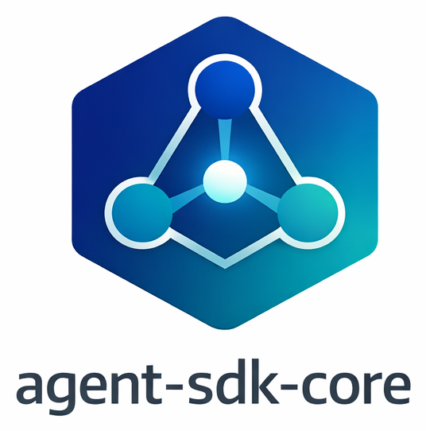

# Agent SDK Core

<p align="center">
  
</p>

## What is agent-sdk-core?

A shared TypeScript package that provides a unified interface for working with AI coding agent SDKs — GitHub Copilot, Claude Code, and OpenAI Codex. Instead of writing separate integration code for each SDK in every project, this package gives you one consistent API for creating agent sessions, streaming events, and managing connections.

## Why use it?

Each AI coding agent SDK has its own API patterns:
- **Copilot** uses event subscriptions with `session.on(callback)` + `sendAndWait()`
- **Claude Code** uses async generators with `for await (const msg of query(...))`
- **Codex** uses threaded streams with `thread.runStreamed()`

This package normalizes all three into a single `AgentProvider` / `AgentSession` interface with a unified `AgentEvent` stream. You write your event handling once, and it works with any agent.

It also provides optional utilities that most agent-powered apps need: WebSocket server/client helpers with heartbeat and reconnection, a progress aggregator for TTS-friendly summaries, and agent CLI detection.

Currently used by three projects: [copilot-kanban-agent](https://github.com/DanWahlin/copilot-kanban-board), agentmic, and zingit.

## Features

- **Unified Provider Interface** — Single `AgentProvider`/`AgentSession` API that works identically across Copilot, Claude Code, and Codex SDKs
- **Rich Event Stream** — 10 granular `AgentEvent` types (thinking, output, command, command_output, file_read, file_write, file_edit, tool_call, test_result, error, complete) with metadata for files, diffs, commands, and test results
- **Session Resume** — Continue previous agent sessions via `resumeSessionId` (Copilot `resumeSession()`, Codex `resumeThread()`, Claude `resume` option)
- **Image/Attachment Support** — Pass screenshots and files to agents via a unified `AgentAttachment` type — each provider handles the SDK-specific format
- **Middleware Hooks** — Inject `onPreToolUse` (e.g., worktree path rewriting) and `onPermissionRequest` (e.g., tool deny-lists) without modifying provider code
- **Agent Detection** — `detectAgents()` checks which CLI tools are installed and available on the system
- **Progress Aggregator** — Batches events over a configurable interval and produces TTS-friendly summaries ("Reading 3 files", "All 5 tests passing")
- **WebSocket Server Utilities** — `createWSServer()` factory with heartbeat ping/pong, `broadcast()` to all clients, configurable path and payload limits
- **WebSocket Client** — `WSClient` class with exponential backoff reconnection, offline message queue, listener-based pub/sub with auto-cleanup
- **Generic WSMessage Envelope** — `WSMessage<T>` typed generic that each consumer extends with its own message vocabulary
- **Tool Classification** — Shared `classifyToolKind()` maps SDK tool names to granular event types across all providers
- **Peer Dependencies** — SDKs are optional peer deps — install only the agents you use

## How to use it

1. **Install the package** and whichever SDK peer dependencies you need (`@github/copilot-sdk`, `@anthropic-ai/claude-agent-sdk`, `@openai/codex-sdk`)
2. **Detect available agents** — call `detectAgents()` at startup to discover which CLIs are installed on the system
3. **Create a provider** — instantiate `CopilotProvider`, `ClaudeProvider`, or `CodexProvider` with optional model config, then call `provider.start()`
4. **Create a session** — call `provider.createSession()` with a `contextId`, `workingDirectory`, `systemPrompt`, and an `onEvent` callback that receives the unified `AgentEvent` stream
5. **Execute a prompt** — call `session.execute(prompt)` which streams events through your callback as the agent works (thinking, file reads/writes, commands, output, etc.)
6. **Handle events** — your `onEvent` callback receives typed `AgentEvent` objects that you route to your UI — render them in a panel, accumulate as text, broadcast via WebSocket, whatever your app needs
7. **Optionally send follow-ups** — call `session.send(message)` to continue the conversation without creating a new session
8. **Optionally use ProgressAggregator** — feed events into it to get batched TTS-friendly summaries like "Modified 3 files, all tests passing"
9. **Optionally use WSClient/createWSServer** — set up WebSocket infrastructure with built-in heartbeat, reconnection, and message queuing
10. **Clean up** — call `session.destroy()` then `provider.stop()` when done

## Installation

```bash
npm install @codewithdan/agent-sdk-core
```

Providers are individually optional — install only the SDKs you use:

```bash
# For Copilot
npm install @github/copilot-sdk

# For Claude Code
npm install @anthropic-ai/claude-agent-sdk

# For Codex
npm install @openai/codex-sdk
```

## Quick Start

```typescript
import { CopilotProvider, detectAgents } from '@codewithdan/agent-sdk-core';

// Check which agents are available
const agents = await detectAgents();
console.log(agents); // [{ name: 'copilot', available: true, ... }, ...]

// Create and use a provider
const provider = new CopilotProvider();
await provider.start();

const session = await provider.createSession({
  contextId: 'my-task-1',
  workingDirectory: '/path/to/project',
  systemPrompt: 'You are a helpful coding assistant.',
  onEvent: (event) => {
    console.log(event.type, event.content);
    // thinking, output, command, file_read, file_write, error, complete, ...
  },
});

const result = await session.execute('Fix the failing tests');
console.log(result.status); // 'complete' or 'failed'

await session.destroy();
await provider.stop();
```

## Package Structure

```
@codewithdan/agent-sdk-core
├── types/          # Event types, provider interfaces, WS message envelope
├── providers/      # Copilot, Claude, Codex providers + detection + ProgressAggregator
└── ws/             # WebSocket server and client utilities
```

### Subpath Imports

```typescript
// Everything
import { CopilotProvider, AgentEvent, WSClient } from '@codewithdan/agent-sdk-core';

// Types only (no runtime code)
import type { AgentEvent, WSMessage } from '@codewithdan/agent-sdk-core/types';

// Providers only
import { ClaudeProvider } from '@codewithdan/agent-sdk-core/providers';

// WebSocket utilities only
import { WSClient, createWSServer } from '@codewithdan/agent-sdk-core/ws';
```

## Event Types

Providers emit `AgentEvent` objects with 10 granular event types:

| Type | Description |
|------|-------------|
| `thinking` | Agent reasoning / intent |
| `output` | General text output |
| `command` | Command or tool started |
| `command_output` | Command execution result |
| `file_read` | Agent read a file |
| `file_write` | Agent wrote/modified a file |
| `file_edit` | Alias — consumers that don't distinguish read/write |
| `tool_call` | Generic tool invocation |
| `test_result` | Test execution results |
| `error` | Error occurred |
| `complete` | Agent finished |

Each event includes:

```typescript
interface AgentEvent {
  id: string;           // UUID
  contextId: string;    // Consumer-defined (taskId, runId, etc.)
  type: AgentEventType;
  content: string;
  timestamp: number;
  metadata?: {
    file?: string;
    command?: string;
    diff?: string;
    agentType?: 'copilot' | 'claude' | 'codex';
    duration?: number;
    error?: string;
    testsPassing?: number;
    testsFailing?: number;
  };
}
```

## Providers

### CopilotProvider

```typescript
const provider = new CopilotProvider({
  model: 'claude-opus-4-20250514',  // optional, defaults to env COPILOT_MODEL
  deniedTools: 'dangerous_tool',     // optional, comma-separated deny list
});
```

Features: streaming events, session resume, file attachments, worktree path rewriting hooks, permission deny-list, spinner filtering.

### ClaudeProvider

```typescript
const provider = new ClaudeProvider({
  model: 'claude-opus-4-20250514',  // optional, defaults to env CLAUDE_MODEL
});
```

Features: async generator streaming, multimodal image support (base64), query lock for concurrency, session resume.

### CodexProvider

```typescript
const provider = new CodexProvider({
  model: 'gpt-5.2-codex',  // optional, defaults to env CODEX_MODEL
});
```

Features: thread-based sessions, thread resume, local image input, structured file change events, AbortController.

### Session Config

All providers accept the same `AgentSessionConfig`:

```typescript
const session = await provider.createSession({
  contextId: 'unique-id',           // Required
  workingDirectory: '/path',         // Required
  systemPrompt: 'instructions',     // Required
  onEvent: (event) => {},           // Required — receives AgentEvent stream
  repoPath: '/original/repo',       // Optional — for worktree rewriting
  resumeSessionId: 'prev-session',  // Optional — resume prior session
  attachments: [{                   // Optional — images/files
    type: 'base64_image',
    data: '...',
    mediaType: 'image/png',
  }],
  hooks: {                          // Optional — middleware injection
    onPreToolUse: (input) => input,
    onPermissionRequest: (req) => ({ kind: 'approved' }),
  },
});
```

## ProgressAggregator

Batches events into human-readable summaries for TTS or status displays:

```typescript
import { ProgressAggregator } from '@codewithdan/agent-sdk-core';

const aggregator = new ProgressAggregator((summary, events) => {
  console.log(summary);
  // "Reading 3 files, Running npm test"
  // "Modified 2 files: App.tsx, index.ts"
  // "Finished. 2 files modified. All 5 tests passing."
}, 12000); // flush every 12s

// Feed events as they arrive
session.onEvent = (event) => aggregator.push(event);

// When done
aggregator.stop(); // flushes remaining events
```

## WebSocket Utilities

### Server

```typescript
import { createWSServer, broadcast } from '@codewithdan/agent-sdk-core';

const { wss, cleanup } = createWSServer({
  server: httpServer,     // or: port: 3000
  path: '/ws',
  maxPayload: 10 * 1024 * 1024,
  heartbeatInterval: 30000,
  onMessage: (ws, data) => { /* route messages */ },
});

// Broadcast to all connected clients
broadcast(wss, { type: 'agent_event', payload: event });
```

### Client

```typescript
import { WSClient } from '@codewithdan/agent-sdk-core';

const client = new WSClient({
  url: 'ws://localhost:3001/ws',
  maxAttempts: 10,       // exponential backoff reconnection
  maxBackoffMs: 30000,
  maxQueueSize: 10,      // offline message buffer
});

const unsubscribe = client.subscribe((msg) => {
  console.log(msg.type, msg.payload);
});

client.send({ type: 'chat', payload: { text: 'hello' } });

// Later
unsubscribe(); // auto-disconnects when no subscribers
```

## Generic WSMessage Envelope

```typescript
interface WSMessage<T = unknown> {
  type: string;     // each app defines its own message types
  payload: T;
  timestamp?: number;
}
```

## Environment Variables

| Variable | Default | Used by |
|----------|---------|---------|
| `COPILOT_MODEL` | `claude-opus-4-20250514` | CopilotProvider |
| `COPILOT_DENIED_TOOLS` | _(none)_ | CopilotProvider |
| `CLAUDE_MODEL` | `claude-opus-4-20250514` | ClaudeProvider |
| `CODEX_MODEL` | `gpt-5.2-codex` | CodexProvider |

## Tests

```bash
npm test
```

## License

MIT
